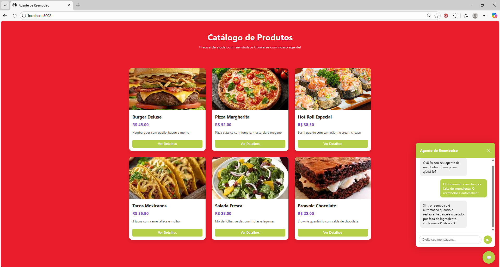

# Agente de Reembolso - POC com RAG

## Descrição

POC de agente interno para decisões de reembolso/cancelamento utilizando RAG (Retrieval-Augmented Generation) com base de conhecimento simulada. O sistema foi desenvolvido com foco em consistência operacional e redução de respostas incorretas.

Este projeto inclui:
- **Backend**: API REST construída com FastAPI que orquestra agentes inteligentes
- **Frontend**: Interface web interativa com widget de chat para simular interações de usuários

### Características Principais

- **RAG (Retrieval-Augmented Generation)**: Utiliza uma base de conhecimento para fundamentar as decisões
- **Sistema de Confiança**: Implementa fallback automático para respostas com baixa confiança
- **Cenários Críticos Testados**:
  - Pedido já saiu para entrega
  - Cancelamento por falha do restaurante
  - Cobrança após cancelamento
- **Arquitetura Multi-Agente**: Sistema baseado em LangGraph com agentes especializados
- **Vector Store**: Busca semântica usando FAISS
- **Interface Interativa**: Frontend com catálogo de produtos e widget de chat integrado

## Tecnologias Utilizadas

### Backend
- **Python 3.11**
- **FastAPI**: API REST para comunicação com o sistema
- **PostgreSQL**: Banco de dados para armazenamento de histórico
- **LangChain** & **LangGraph**: Framework para agentes e orquestração
- **Google Gemini**: Modelos de linguagem (2.5-pro e 2.5-flash)
- **FAISS**: Vector store para busca semântica
- **SQLAlchemy**: ORM para interação com banco de dados
- **Pydantic**: Validação de dados estruturados

### Frontend
- **HTML5 / CSS3 / JavaScript**: Interface web responsiva
- **Nginx**: Servidor web para servir os arquivos estáticos
- **Widget de Chat**: Interface integrada para comunicação com o agente

### Infraestrutura
- **Docker & Docker Compose**: Containerização e orquestração de serviços

## Como Instalar

### Pré-requisitos

- **Docker** e **Docker Compose** instalados
- Conta no Google AI Studio para obter API Key do Gemini


### Instalação

1. **Clone o repositório**
```bash
git clone <url-do-repositorio>
cd "Agente de Rembolso"
```

2. **Configure as variáveis de ambiente**

Copie o arquivo `.env.example` para `.env` e preencha com suas credenciais:
```bash
# Windows (PowerShell)
Copy-Item .env.example .env

# Linux/Mac
cp .env.example .env
```

Edite o arquivo `.env` e configure:
```env
# API do Google Gemini
GEMINI_API_KEY=sua_chave_api_aqui

# Configurações do PostgreSQL
POSTGRES_USER=admin
POSTGRES_PASSWORD=admin
POSTGRES_DB=gemini_db
POSTGRES_HOST=localhost
POSTGRES_PORT=5436

# Porta do Backend
# IMPORTANTE: Recomendado usar 8002 pois o frontend está configurado para esta porta
BACKEND_PORT=8002

# Porta do Frontend
FRONTEND_PORT=3002
```

> **Nota**: Obtenha sua API Key em [Google AI Studio](https://aistudio.google.com/apikey)

> **⚠️ Importante**: É recomendável manter o `BACKEND_PORT=8002` pois o frontend está configurado para se comunicar com o backend nesta porta. Se alterar, será necessário atualizar o arquivo `frontend/scripts/api.js`.

3. **Execute com Docker Compose**
```bash
docker-compose up -d --build
```

4. **Acesse a aplicação**
- **Frontend**: http://localhost:3002
- **API Backend**: http://localhost:8002
- **Documentação da API**: http://localhost:8002/docs

## Como Usar

### Interface Web (Frontend)

1. **Inicie os serviços**
```bash
docker-compose up -d --build
```

2. **Acesse o frontend**
Abra seu navegador em http://localhost:3002


*Interface do catálogo de produtos com widget de chat integrado*

3. **Interaja com o agente**
- Clique no botão de chat no canto inferior direito da tela
- Digite sua dúvida sobre reembolsos
- O agente responderá com base na base de conhecimento

### API REST (Backend)

1. **Acesse a documentação interativa**
Visite http://localhost:8002/docs para explorar a API

2. **Faça uma requisição de exemplo**
```bash
curl -X POST "http://localhost:8002/chat/" \
     -H "Content-Type: application/json" \
     -d '{"user_message": "O cliente quer reembolso, mas o pedido já saiu para entrega. Ainda é permitido?"}'
```

3. **Consulte o histórico de mensagens**
```bash
curl "http://localhost:8002/history/"
```


### Exemplos de Perguntas

- "O cliente pode pedir reembolso após o pedido sair para entrega?"
- "Houve falha do restaurante, o cliente tem direito a reembolso?"
- "O cliente foi cobrado após cancelar o pedido, e agora?"
- "Há situações em que o reembolso não se aplica?"

## Arquitetura do Sistema

### Fluxo de Processamento

```
Entrada do Usuário
    ↓
[Classification Agent] → Classifica a consulta
    ↓
[Reimbursement Agent] → Busca na base (RAG) + Gera resposta
    ↓
[Revisor Agent] → Valida confiança + Refina resposta
    ↓
Resposta Final
```

### Estrutura de Diretórios

```
Agente de Rembolso/
├── .env                         # Variáveis de ambiente (não versionado)
├── .env.example                 # Exemplo de configuração
├── docker-compose.yaml          # Orquestração dos containers
├── README.md                    # Documentação do projeto
│
├── backend/                     # API e lógica de negócio
│   ├── index.py                 # API FastAPI (ponto de entrada)
│   ├── requirements.txt         # Dependências Python
│   ├── Dockerfile               # Imagem Docker do backend
│   │
│   ├── assets/                  # Recursos estáticos
│   │   └── graph.png            # Diagrama do fluxo do grafo
│   │
│   ├── data/                    # Base de conhecimento
│   │   └── base_conhecimento_ifood_genai-exemplo.csv
│   │
│   ├── faiss_index/             # Índices de busca vetorial
│   │   ├── index.faiss          # Índice FAISS
│   │   └── index.pkl            # Metadados do índice
│   │
│   ├── database/                # Configuração do banco de dados
│   │   ├── database.py          # SQLAlchemy setup e sessões
│   │   └── checkpoints.db       # Base SQLite para checkpoints
│   │
│   ├── models/                  # Modelos SQLAlchemy (ORM)
│   │   └── message_model.py     # Modelo de mensagens do chat
│   │
│   ├── routes/                  # Rotas da API FastAPI
│   │   ├── chat_router.py       # Endpoint de chat
│   │   └── history_router.py    # Endpoint de histórico
│   │
│   ├── schemes/                 # Schemas Pydantic
│   │   └── message_scheme.py    # Validação de requests/responses
│   │
│   └── graph/                   # Sistema de agentes LangGraph
│       ├── graph.py             # Orquestração do fluxo principal
│       ├── state.py             # Estado compartilhado entre nós
│       ├── insertion.py         # Criação e inserção no vector store
│       ├── utils.py             # Funções auxiliares
│       │
│       ├── agents/              # Definição dos agentes especializados
│       │   ├── classification_agent.py    # Classifica tipo de consulta
│       │   ├── reimbursement_agent.py     # Gera resposta com RAG
│       │   └── revisor_agent.py           # Valida e refina respostas
│       │
│       ├── nodes/               # Nós executáveis do grafo
│       │   ├── classification_node.py
│       │   ├── reimbursement_node.py
│       │   └── revisor_node.py
│       │
│       └── tools/               # Ferramentas disponíveis aos agentes
│           └── vector_store_tool.py       # Busca semântica no FAISS
│
└── frontend/                    # Interface web do usuário
    ├── index.html               # Página principal com catálogo
    ├── Dockerfile               # Imagem Docker do frontend (Nginx)
    │
    ├── assets/                  # Recursos estáticos
    │   └── products/            # Imagens dos produtos
    │       ├── burger.jpg
    │       ├── pizza.jpg
    │       ├── sushi.jpg
    │       ├── tacos.jpg
    │       ├── salad.jpg
    │       └── dessert.jpg
    │
    ├── scripts/                 # JavaScript
    │   ├── api.js               # Cliente HTTP para comunicação com backend
    │   └── widget.js            # Lógica do widget de chat
    │
    └── styles/                  # Folhas de estilo
        ├── main.css             # Estilos da página principal
        └── widget.css           # Estilos do widget de chat
```

## Frontend

### Descrição

O frontend é uma aplicação web estática que simula uma plataforma de e-commerce com um widget de chat integrado para atendimento ao cliente. Foi desenvolvido para demonstrar como o agente de reembolso pode ser integrado em uma interface real.

### Funcionalidades

- **Catálogo de Produtos**: Exibe produtos simulados (burgers, pizzas, sushi, etc.)
- **Widget de Chat**: Interface flutuante no canto inferior direito
- **Comunicação em Tempo Real**: Integração com a API do backend via JavaScript
- **Histórico de Conversas**: Mantém o contexto da conversa com thread_id
- **Design Responsivo**: Adaptável a diferentes tamanhos de tela

### Arquitetura do Frontend

```
Usuário → index.html → widget.js → api.js → Backend (localhost:8002)
                         ↓
                    widget.css
```

O frontend se comunica com o backend através de requisições HTTP para os endpoints:
- `POST /chat/`: Enviar mensagens ao agente
- `GET /chat_history/`: Recuperar histórico de conversas

## Sistema de Confiança

O agente utiliza um score de confiança (0.0 a 1.0) para avaliar suas respostas:

- **≥ 0.7**: Resposta considerada confiável
- **< 0.7**: Sistema aciona o revisor para refinamento
- **Fallback**: Sugere escalonamento humano quando necessário

## Personalização

### Atualizar Base de Conhecimento

1. Edite `backend/data/base_conhecimento_ifood_genai-exemplo.csv`
2. Adicione/modifique políticas no formato:
```csv
categoria,pergunta,resposta,fonte
reembolso,"Pergunta exemplo","Resposta exemplo","Política X.Y"
```
3. Delete `backend/faiss_index/` para forçar recriação do índice
4. Execute o sistema novamente

### Ajustar Modelos

No arquivo dos agentes (`backend/graph/agents/*.py`), você pode alterar:

```python
llm = ChatGoogleGenerativeAI(
    model="gemini-2.5-pro",  # ou "gemini-2.5-flash"
    temperature=0
)
```

## Visualização do Grafo

O sistema gera automaticamente uma visualização do fluxo dos agentes em `backend/assets/graph.png`.

## Licença

Este é um projeto de demonstração (POC).

---

